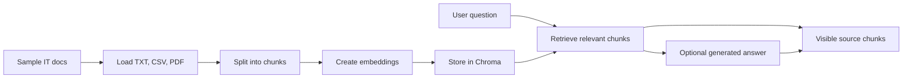

# IT Operations RAG Knowledge Assistant

A Streamlit app that searches sample IT Operations documents and shows the source chunks used to answer each question.

## Problem

IT support teams often have SOPs, outage notes, ticket logs, asset policies, and access policies spread across different files. This project turns those documents into a searchable knowledge base so support questions can be answered with visible sources.

This is a public portfolio project. It uses sample practice documents only.

## Tech Stack

- **Python** for document processing and application logic
- **Streamlit** for the user interface
- **LangChain** for document objects, chunking, and optional LLM integration
- **Chroma** for local vector search
- **pandas** for CSV ticket logs
- **pypdf** for PDF text extraction

## Core Features

- Loads sample TXT, CSV, and PDF IT Operations documents.
- Splits documents into searchable chunks.
- Stores embeddings and source metadata in Chroma.
- Retrieves relevant chunks for IT support questions.
- Runs in retrieval-only mode without an API key.
- Optionally generates source-grounded answers with OpenAI or OpenRouter.
- Displays exact source chunks so answers can be verified.

## How It Works



The default version uses local deterministic embeddings so the app can run without an API key or model download. Chroma still stores vectors and source metadata. Generated answers are optional.

## Run Locally

### Mac

```bash
cd itops-rag-knowledge-assistant
python3 -m venv .venv
source .venv/bin/activate
pip install -r requirements.txt
streamlit run app.py
```

### Windows

```bash
cd itops-rag-knowledge-assistant
python -m venv .venv
.venv\Scripts\activate
pip install -r requirements.txt
streamlit run app.py
```

Open the local URL Streamlit prints, usually:

```bash
http://localhost:8501
```

## Optional Generated Answers

The app works without an API key. Without a key, it retrieves and displays source chunks only.

To enable generated answers, copy the example environment file:

```bash
cp .env.example .env
```

Then add one key to `.env`:

```bash
OPENAI_API_KEY=your_key_here
```

or:

```bash
OPENROUTER_API_KEY=your_key_here
```

Never commit `.env`.

## Demo Questions

- What is the escalation process for a P1 outage?
- What should happen after a major outage?
- How should VPN incidents be handled?
- What assets need replacement or refresh?
- What is the access request approval process?
- How should repeat password reset tickets be reduced?
- What do the ticket logs show about recurring support issues?

## Safety

This repo is configured to exclude local and sensitive files:

- `.env`
- `.venv/`
- `chroma_db/`
- `uploaded_docs/`
- cache files
- local logs and temporary files

Do not upload real company files, tickets, customer data, private internal policies, credentials, or API keys.

## Portfolio Proof

**Resume title:** Built a Retrieval-Augmented Generation Pipeline for IT Operations Knowledge Search.

**Resume bullet:** Built a Python-based RAG pipeline using LangChain, Chroma vector database, and Streamlit to ingest operational documents, retrieve relevant context, and generate source-grounded answers for IT support and workflow analysis.

## More Details

- [Interview guide](docs/rag-pipeline-interview-guide.md)
- [Demo checklist](docs/demo-checklist.md)
- [Demo script](docs/demo-script.md)
- [Screenshot guide](screenshots/README.md)
