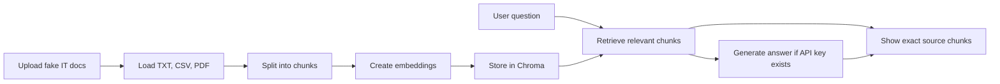

# IT Operations RAG Knowledge Assistant

A beginner-friendly Streamlit app that searches fake IT Operations documents and shows the exact source chunks used for each answer.

This repo is safe for a public portfolio because it uses fake sample documents only. Do not upload real company files, secrets, tickets, customer data, or private internal policies.

## Resume Proof

**Resume title:** Built a Retrieval-Augmented Generation Pipeline for IT Operations Knowledge Search.

**Resume bullet:** Built a Python-based RAG pipeline using LangChain, Chroma vector database, and Streamlit to ingest operational documents, retrieve relevant context, and generate source-grounded answers for IT support and workflow analysis.

## What The App Does

- Loads fake IT Operations SOPs, ticket logs, outage notes, asset inventory notes, and policy docs.
- Supports TXT, CSV, and PDF files.
- Splits documents into smaller searchable chunks.
- Stores chunk embeddings and metadata in Chroma.
- Lets a user ask IT Operations questions.
- Retrieves relevant source chunks.
- Works in retrieval-only mode without an API key.
- Generates a source-grounded answer when an OpenAI or OpenRouter API key exists.
- Shows the exact chunks used so the answer can be verified.

## How It Works



The beginner version uses local deterministic embeddings by default so the demo works without an API key or model download. Chroma still stores vectors and source metadata. If you want to experiment with Hugging Face sentence-transformer embeddings later, see the optional section below.

## Mac Setup

```bash
cd itops-rag-knowledge-assistant
python3 -m venv .venv
source .venv/bin/activate
pip install -r requirements.txt
streamlit run app.py
```

Open the local URL Streamlit prints, usually:

```bash
http://localhost:8501
```

## Windows Setup

```bash
cd itops-rag-knowledge-assistant
python -m venv .venv
.venv\Scripts\activate
pip install -r requirements.txt
streamlit run app.py
```

Open the local URL Streamlit prints, usually:

```bash
http://localhost:8501
```

## Optional Generated Answers

The app works without an API key. Without a key, it retrieves and displays source chunks only.

To enable generated answers:

```bash
cp .env.example .env
```

Then edit `.env` and add one key:

```bash
OPENAI_API_KEY=your_key_here
```

or:

```bash
OPENROUTER_API_KEY=your_key_here
```

Never commit `.env`.

## Optional Hugging Face Embeddings

The beginner demo does not require this. To try sentence-transformer embeddings:

```bash
pip install sentence-transformers langchain-huggingface
```

Then set this in `.env`:

```bash
USE_HUGGINGFACE_EMBEDDINGS=true
```

## Demo Questions

- What is the escalation process for a P1 outage?
- What should happen after a major outage?
- How should VPN incidents be handled?
- What assets need replacement or refresh?
- What is the access request approval process?
- How should repeat password reset tickets be reduced?
- What do the ticket logs show about recurring support issues?

## Demo Checklist

- [ ] Start the app with `streamlit run app.py`.
- [ ] Select `Sample docs only`.
- [ ] Click `Build / Rebuild Chroma Index`.
- [ ] Confirm the app indexes TXT, CSV, and PDF sample documents.
- [ ] Ask: `What is the escalation process for a P1 outage?`
- [ ] Confirm an answer appears.
- [ ] Confirm `Source Chunks Used` appears.
- [ ] Open each source expander and verify the answer came from visible chunks.
- [ ] Ask: `What assets need replacement or refresh?`
- [ ] Confirm at least one PDF or asset inventory source appears.
- [ ] Run once without an API key to prove retrieval-only mode works.
- [ ] Optionally run once with an API key to prove generated answers work.

## Screenshots To Capture

Save screenshots in the `screenshots/` folder:

1. `01-home.png` - app open before indexing, showing the sidebar and question box.
2. `02-index-built.png` - success message after clicking `Build / Rebuild Chroma Index`.
3. `03-retrieval-answer.png` - retrieval-only answer for a P1 outage question.
4. `04-source-chunks.png` - expanded `Source Chunks Used` section.
5. `05-pdf-source.png` - answer showing a PDF or asset inventory source.

Do not include screenshots containing real company data, real tickets, real customer names, or API keys.

## GitHub Safety

This repo is configured to exclude:

- `.env`
- `.venv/`
- `chroma_db/`
- `uploaded_docs/`
- cache files
- local logs and temporary files

Only `.env.example` should be committed. The sample documents are fake IT Operations documents for portfolio demonstration only.

## GitHub Upload Steps

```bash
git init
git add .
git status
git commit -m "Build IT Operations RAG knowledge assistant"
git branch -M main
git remote add origin https://github.com/YOUR_USERNAME/itops-rag-knowledge-assistant.git
git push -u origin main
```

Before pushing, confirm `git status` does not show `.env`, `.venv/`, `chroma_db/`, or `uploaded_docs/`.

## 2-Minute Demo Script

1. "This is my IT Operations RAG Knowledge Assistant. It uses fake SOPs, outage notes, ticket logs, asset inventory notes, and policy docs."
2. "First I build the Chroma index. The app loads TXT, CSV, and PDF files, splits them into chunks, creates embeddings, and stores the chunks with source metadata."
3. "Now I ask a question: What is the escalation process for a P1 outage?"
4. "Without an API key, the app still works in retrieval-only mode and shows the most relevant source chunks."
5. "The important part is source transparency. I can expand the source chunks and verify exactly where the answer came from."
6. "If I add an OpenAI or OpenRouter API key, the app uses the retrieved chunks as context to generate a grounded answer."
7. "For safety, this repo uses fake data only and excludes `.env`, uploaded private docs, and the local Chroma database from GitHub."
