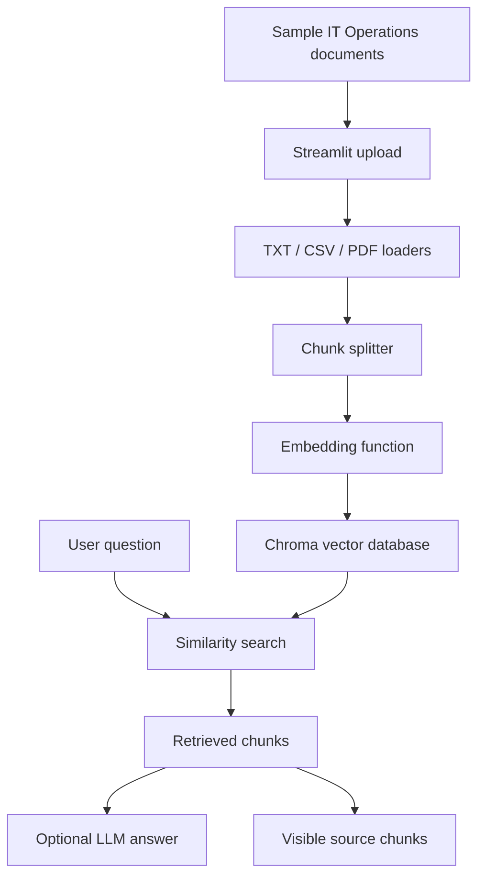

# IT Operations RAG Pipeline Interview Guide

## Problem

IT teams often have SOPs, outage notes, ticket logs, asset policies, and access policies spread across different documents. That makes it slow to find the right procedure during support work.

## Goal

Build a small knowledge assistant that can search sample IT Operations documents, answer questions, and show the source chunks used for each answer.

## Architecture

## Tools Used And Why

- **Python:** simple language for data loading, text processing, and AI workflows.
- **Streamlit:** fast way to build a working app interface.
- **LangChain:** document objects, text splitting, and LLM integration.
- **Chroma:** local vector database for storing embeddings and source metadata.
- **pandas:** reads CSV ticket logs.
- **pypdf:** extracts text from PDF practice documents.

## Build Process

1. Created sample IT Operations practice documents only.
2. Built loaders for TXT, CSV, and PDF files.
3. Split large document text into smaller chunks.
4. Converted chunks into vectors with a local embedding function.
5. Stored vectors and metadata in Chroma.
6. Added a question box in Streamlit.
7. Used Chroma similarity search to retrieve relevant chunks.
8. Added retrieval-only mode for no API key.
9. Added optional generated answers when an OpenAI or OpenRouter key exists.
10. Displayed the exact source chunks so the answer can be checked.

## Problems Solved

- Kept the app useful without an API key.
- Avoided real company data by using sample IT Operations docs only.
- Added PDF support and tested it with a sample PDF.
- Excluded `.env`, uploaded documents, virtual environments, and local Chroma files from GitHub.
- Separated the RAG pipeline logic from the Streamlit UI so the core logic can be tested.

## What I Learned

- RAG is not just asking an LLM a question. It first retrieves relevant context.
- Chunk size matters because large documents need to become searchable pieces.
- Source metadata matters because users need to verify where answers came from.
- A portfolio AI project should be safe to publish and should not include private data.

## What I Would Improve Next

- Add automated tests for each loader.
- Add better semantic embeddings for higher retrieval quality.
- Add a small evaluation set of expected questions and source files.
- Add deployment instructions after the local version is stable.

## Resume-Ready Explanation

Built a Python and Streamlit RAG app that ingests sample IT Operations documents, chunks them, embeds them, stores them in Chroma, retrieves relevant context for user questions, and shows the source chunks used for each answer.

## 60-Second Interview Answer

"I built an IT Operations RAG Knowledge Assistant as a beginner portfolio project. The problem is that IT teams often have SOPs, outage notes, ticket logs, asset policies, and access policies spread across documents. My goal was to make those documents searchable and answerable with sources. The app uses Streamlit for the interface. It loads sample TXT, CSV, and PDF documents, splits them into chunks, converts those chunks into embeddings, and stores them in Chroma. When a user asks a question, the app searches Chroma for the most relevant chunks. If an API key exists, it uses those chunks to generate a grounded answer. If no key exists, it still works in retrieval-only mode. The most important safety decision was using sample practice data only and excluding `.env`, uploaded private docs, and local database files from GitHub."
